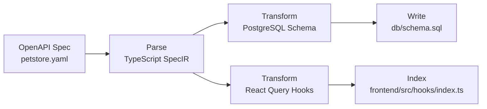

# SpecStack

[](LICENSE)
[](https://www.typescriptlang.org/)
[](https://swagger.io/specification/)

**SpecStack** is a blazing-fast code generation toolkit that transforms OpenAPI 3.0 specs into:

- 🗃️ PostgreSQL schemas and SQL functions
- ⚖️ Fully typed React Query hooks
- 🦍 A simple, powerful intermediate model (SpecIR) for future extensibility

---

## ✨ Features

- 🔥 Parse OpenAPI 3.0 specs into strong types
- 💾 Generate DB schemas and CRUD functions
- ⚡ Generate React Query hooks automatically
- 🔹 Auto-index all generated hooks for clean imports
- ⚖️ Full TypeScript safety
- 💡 Built to extend: add zod validators, typed fetchers, SDKs, and more

---

## ⚡ Quick Start

### 1. Install Dependencies

```bash
npm install
```

### 2. Generate Code

```bash
npm run dev <path/to/your/openAPI/spec.yaml>
```
For a quick test, run `npm run dev ./tests/petstore.yaml`.

Optional: specify output directory

```bash
npm run dev <path/to/your/openAPI/spec.yaml> ./custom_output_dir
```

Running the command above will create React Query hooks under `generated/frontend/src/hooks`.
Import these hooks in your React components (e.g., `useGetPetById`) after generation:

```ts
import { useGetPetById } from '../generated/frontend/src/hooks';
```

---

## 🛠️ How It Works

| Stage | What Happens |
|:------|:-------------|
| Parse | OpenAPI spec ➔ Strongly typed SpecIR model |
| Transform | SpecIR ➔ DB SQL + React Hooks |
| Write | Files saved to `generated/` automatically |
| Index | Frontend hooks auto-reexported |

### 📊 Visualization: OpenAPI ➔ SpecIR ➔ SQL ➔ Hooks



| Stage | Sample Output |
|:------|:--------------|
| **Parse** | ```yaml
openapi: 3.0.3
paths:
  /pets:
    get:
      operationId: listPets
      responses:
        '200':
          content:
            application/json:
              schema:
                $ref: '#/components/schemas/Pet'
components:
  schemas:
    Pet:
      type: object
      required: [id, name]
      properties:
        id:
          type: integer
        name:
          type: string
        tag:
          type: string
``` |
| **Transform → SpecIR** | ```ts
const petEntity = specIR.entities.create({
  name: 'Pet',
  primaryKey: ['id'],
  fields: [
    { name: 'id', type: 'integer', nullable: false },
    { name: 'name', type: 'string', nullable: false },
    { name: 'tag', type: 'string', nullable: true },
  ],
});
``` |
| **Transform → PostgreSQL** | ```sql
CREATE TABLE IF NOT EXISTS pet (
  id INTEGER NOT NULL,
  name TEXT NOT NULL,
  tag TEXT,
  PRIMARY KEY (id)
);
``` |
| **Transform → React Hooks** | ```ts
export const useListPets = () =>
  useQuery({
    queryKey: ['listPets'],
    queryFn: () => client.get('/pets'),
  });
``` |
| **Write & Index** | Generated SQL is written to `generated/db/schema.sql` and hooks are re-exported from `generated/frontend/src/hooks/index.ts`. |

---

## 📄 Example Outputs

### SQL Table

```sql
CREATE TABLE IF NOT EXISTS Pet (
  id INTEGER NOT NULL,
  name VARCHAR NOT NULL,
  tag VARCHAR,
  PRIMARY KEY (id)
);
```

### React Query Hook

```ts
import { useQuery } from '@tanstack/react-query';

export function useGetPetById(params: { id: number }) {
  return useQuery(['getPetById'], async ({ params }) => {
    const response = await fetch(`/pets/${encodeURIComponent(params.id)}`);
    return response.json();
  });
}
```

---

## 🚀 Roadmap

- [ ] Zod validator generation
- [ ] Full CRUD SQL body generation
- [ ] OpenAPI mock server from SpecIR
- [ ] Swagger UI preview generation
- [ ] GitHub Action for auto-regeneration

---

## 🧬 Philosophy

- **Single Source of Truth**: Your OpenAPI spec defines database + API + client.
- **Type First**: No loose strings. Types everywhere.
- **Composable**: SpecIR can target GraphQL, SDKs, gRPC easily later.
- **Minimalism**: Only necessary code. No heavy runtimes.

---

## 👏 Acknowledgments

- Inspired by OpenAPI Generator, Prisma, tRPC
- Built lightweight for modern TypeScript apps

---

## 📄 License

[MIT License](LICENSE) © 2025 SpecStack Project
